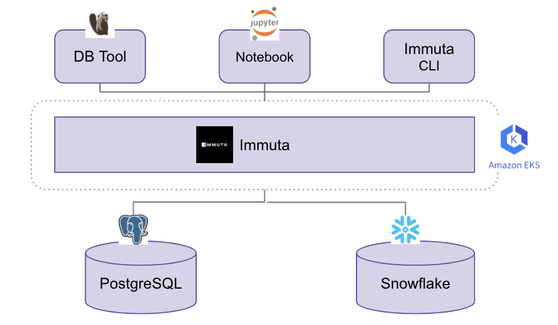

# Immuta (on EKS)

## Pre-requisites
 - IAM Account w/ Admin Access
 - Command Line utils - aws, kubectl, helm, eksctl, k9s


 ## Steps

1. Add Immuta Helm repo
    ```
    helm repo add --username <username> --password <password> immuta https://archives.immuta.com/charts
    ```

2. Verify Helm repo
    ```
    helm search repo immuta
    ```
    eg. output:
    ```
    NAME         	CHART VERSION	APP VERSION	    DESCRIPTION                      
    immuta/immuta	4.6.9        	2021.2.0   	    Immuta: Automated Data Governance
    ```

3. Swith to AWS Profile 
    ```
    $ aws configure --profile <aws_profile>
    $ export AWS_PROFILE=<aws_profile>
    $ aws sts get-caller-identity
    ```

4. Create IAM Policy for Backups
    ```
    {
        "Version": "2012-10-17",
        "Statement": [
            {
                "Sid": "ImmutaS3Backups00",
                "Effect": "Allow",
                "Action": [
                    "s3:PutObject",
                    "s3:GetObject",
                    "s3:ListBucket",
                    "s3:DeleteObject"
                ],
                "Resource": [
                    "arn:aws:s3:::<bucket>",
                    "arn:aws:s3:::<bucket>/<prefix>/database/*",
                    "arn:aws:s3:::<bucket>/<prefix>/query-engine/*"
                ]
            }
        ]
    }
    ```

5. Spin up EKS Cluster
    ```
    $ cd eks
    $ ./create-eks-cluster.sh
    ```

6. Create an IAM role for a service account in order to use S3 for shared storage
    ```
    eksctl create iamserviceaccount \
    --name <service_account_name> \
    --namespace <service_account_namespace> \
    --cluster <cluster_name> \
    --attach-policy-arn <IAM_policy_ARN> \
    --approve \
    --override-existing-serviceaccounts
    ```

7. Deploy Immuta 
    ```
    helm install <YOUR RELEASE NAME> immuta/immuta \
    --values eks/immuta-values.yaml
    ```

8. Define Global Policies

9. Connect to Data Sources


## Architecture



